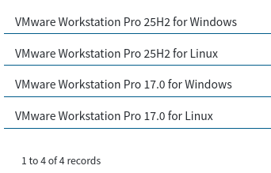
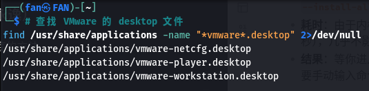
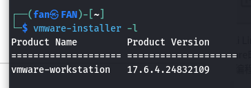
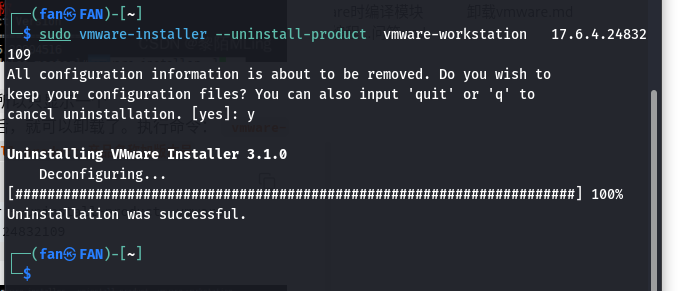

# Vmware安装与下载
## 安装包选择

- vmware下载页： https://support.broadcom.com/group/ecx/downloads


- 25H2为2025年新发布版本，H2表示下半年，H1则是上半年；17.6.4之类的则是旧版本的版本号书写方式
- 选择最新的没问题

# Vmware下载
## 验证硬件虚拟化
- 通过以下命令检查 CPU 是否支持虚拟化（需在 BIOS 中启用 VT-x/AMD-V）：

```
src/content/posts/linuxuse/bundlegrep -E --color 'vmx|svm' /proc/cpuinfo
```

- 输出 `vmx` 表示 Intel CPU 支持 VT-x；
- 输出 `svm` 表示 AMD CPU 支持 AMD-V；
- 无输出：需进入 BIOS 启用虚拟化（重启电脑，按 Del进入 BIOS，在“Advanced”→“CPU Configuration”中开启）。
> 我电脑是开的。

## 验证文件完整性（可选但推荐）
- 为避免下载文件损坏，校验 SHA256 哈希：

1. 在下载页获取官方哈希值（“Checksum”链接）。
2. 计算本地文件哈希：

```
sha256sum VMware-Workstation-Full-*.bundle
```

> 25H2u1版本的哈希值：721aa93c4ebcaa51ac6db75ed97c7a4db10aa88110446890db1e40bfafc7566a

3. 对比两者是否一致，不一致则重新下载。

## 安装依赖组件
- VMware 需编译内核模块，需提前安装以下依赖（根据发行版选择命令）：
### Debian/Ubuntu 系列
```
sudo apt update && sudo apt install -y \
  build-essential \
  gcc \
  g++ \
  make \
  linux-headers-$(uname -r) \  # 匹配当前内核版本的头文件
  dkms \                        # 动态内核模块支持（自动重建模块）
  libssl-dev \                  # OpenSSL 开发库（部分模块依赖）
  libgl1-mesa-glx \             # OpenGL 支持
  libxtst6                      # X11 测试库（GUI 依赖）
```

>我这三个没有.
>libssl-dev：未找到命令
>libgl1-mesa-glx：未找到命令
>libxtst6：未找到命令

## 运行安装程序

启动完成，进入应用（即GUI安装向导）

>[!tip]- 万幸
>OK呀，25H2u1版本也是没有内核兼容性问题呀，很舒服
>17.6.4以下都有内核过新兼容性，详情可见本页 [相关链接](#相关链接)，不过多赘述了。

>[!bug]- 不幸
>最新还是会有bug的，不过后文有解决办法

---
# Vmware使用
- 使用难度主要在不会英语，还是多学一学英语吧

> [!info]- Windows10激活密钥
> 使用方法：
> 脱机先进入系统桌面
> 以管理员身份运行cmd，先执行 
> ```
> slmgr /ipk W269N-WFGWX-YVC9B-4J6C9-T83GX
> ```
> 然后执行
>  ```
> slmgr /skms kms.03k.org
> ```
> 最后执行 `slmgr /ato` 等待1分钟

---
# Vmware常见问题
## 三连报错 ( 发生于VMware25H2u1及以下版本 )
```
#这三个报错以弹窗形式出现
#第一个报错
Could not open /dev/vmmon: ?????????.  
Please make sure that the kernel module `vmmon' is loaded.
#翻译：无法打开 /dev/vmmon：？？？？？？？？。
请确保内核模块 `vmmon` 已加载。


#第二个报错
Failed to initialize monitor device.

Unable to change virtual machine power state: Transport (VMDB) error -14: Pipe connection has been broken.
#翻译：初始化监控设备失败。

无法更改虚拟机电源状态：传输（VMDB）错误 -14：管道连接已中断。


#第三个报错
Install the VMware Tools package inside this virtual machine. After the guest operating system starts, select VM > Install VMware Tools… and follow the instructions.
#翻译：在此虚拟机内安装 VMware Tools 软件包。操作系统启动后，选择 VM > 安装 VMware Tools… 并按照说明操作。
```
### 先说结论
- 运行此命令即可解决：
```bash
sudo vmware-modconfig --console --install-all
```
### 再说原因
- 看到“Could not open /dev/vmmon”这个错误，不用太担心。这在 Linux，特别是像 Kali 这种更新频繁的系统上很常见。核心问题通常是 **VMware 的内核模块（ `vmmon` 和 `vmnet` ）没有正确编译、加载，或者与当前内核版本不兼容** ，尤其是在系统或内核更新后。
### 修复与思路

#### 第一步：基础排查与快速修复
在尝试复杂方法前，可以先执行以下几个简单操作，它们常常可能直接解决问题。

- **重启VMware服务** ：在终端中运行以下命令，重启VMware相关的系统服务 [3](https://www.techbloat.com/vmware-workstation-could-not-open-dev-vmmon.html#respond) 。
	```
	sudo systemctl restart vmware.service
	```
- **手动加载模块** ：如果服务重启无效，可以尝试手动加载模块。
	```
	sudo modprobe vmmon
	sudo modprobe vmnet
	```
	验证模块是否加载成功：
	```
	lsmod | grep vmmon
	lsmod | grep vmnet
	```
	- **小提示** ：如果提示未找到 `vmmon` 模块，请跳过此步，直接看下面的方案一。

> [!note]+ 返回结果
> 基础排查与快速修复返回信息：
>  ```
>  ┌──(fan㉿FAN)-\[~\]
>  └─$ sudo systemctl restart vmware.service
>  \[sudo\] fan 的密码：
>  Failed to restart vmware.service: Unit vmware.service not found.
>  ┌──(fan㉿FAN)-\[~\]
>  └─$ sudo modprobe vmmon sudo modprobe vmnet
>  ┌──(fan㉿FAN)-\[~\] 
>  └─$ lsmod | grep vmmon
>     lsmod | grep vmnet 
>  vmmon 184320 0 
>  vmnet 81920 0 
>  ```
>
> 返回结果两个模块加载了，但进入VMware还会返回一个报错
> - **报错信息**： Unable to change virtual machine power state: Failed to open device "/dev/vmci":????????? Please make sure that the kernel module 'vmci' is loaded. Module 'DevicePowerOn' power on failed. Failed to start the virtual machine. 
> - **报错信息翻译**：无法更改虚拟机电源状态：打开设备 "/dev/vmci" 失败：????????? 请确保内核模块 'vmci' 已加载。模块 'DevicePowerOn' 开机失败。启动虚拟机失败。> 

> [!tip]+ 💡 补充说明：关于 vmware.service 未找到
> 之前运行 `sudo systemctl restart vmware.service` 时提示 `Unit vmware.service not found` ，这是 **正常现象** 。
>
>- 原因是 VMware Workstation Pro / Player 的官方 `.bundle` 安装包，它的服务管理脚本是旧式 SysV init 风格，而不是 systemd 的 service 文件。
>- 如需重启 VMware 后台服务，应使用：
>```bash
>sudo /etc/init.d/vmware restart
>```
>或
>```bash
>sudo vmware-modconfig --console --install-all   # 此命令也会自动重启相关服务
>```
 
#### 第二步：分析当前状况
***报错情况解析***：
- vmmon 和 vmnet 已加载，说明内核模块编译和加载基本正常，但缺少 vmci 模块。
- vmci 是 VMware 的虚拟机通信接口模块，用于主机与虚拟机之间的通信。若缺失，会导致虚拟机启动失败。
- 因为 vmware.service 不存在，可能用户使用的是 VMware Workstation 而非 VMware 的 systemd 服务版本，或者安装路径不同。这常见于使用官方.bundle 安装的 Workstation/Player。

> [!tip]- 进一步解析（更详细版）
> VMware 需要访问 `/dev/vmci` 这个设备文件，但它不存在，因为 **`vmci` 内核模块没有被加载** 。
>
>- `vmci` 是 **VMware Virtual Machine Communication Interface** 的缩写，负责主机与虚拟机之间的高效通信（比如剪贴板共享、拖放文件、时间同步等）。
>- 虚拟机启动时会强制检查此设备，缺了它就会直接报错并中止启动。

***结论***：
之前的操作成功加载了 `vmmon` 和 `vmnet` ，但漏掉了 `vmci` 。所以现在的问题非常明确： **需要把 `vmci` 模块也加载上** 。

#### 第三步：尝试修复vmci模块
- 尝试加载vmci模块，在终端中运行：
```bash
sudo modprobe vmci
```

- ***返回结果***：
```bash
┌──(fan㉿FAN)-\[~\] └─$ sudo modprobe vmci 
modprobe: FATAL: Module vmci not found in directory /lib/modules/6.19.11+kali-amd64 
```

- ***解析***：
执行了 `sudo modprobe vmci` ，但提示模块未找到。  ***修复失败***

#### 第四步：思考其他解决方案
- ***可能的解决方案***：
1. 使用 `vmware-modconfig` 重建模块
2. 从源码编译 `vmware-host-modules` 、以及安装必要的依赖。

- ***可能原因***：
`modprobe: FATAL: Module vmci not found` 这个错误信息比较明确，系统里根本不存在 `vmci` 这个内核模块文件。这通常是因为模块没有成功编译安装，或者与当前的内核版本（你的是 `6.19.11` ）不兼容，这是个已知的常见问题 。

#### 第五步：使用 `vmware-modconfig` 重建模块 or 从源码编译 `vmware-host-modules` 、以及安装必要的依赖
##### 方案一：使用VMware官方工具重建模块（首选）
这是VMware官方推荐的方法，会自动检测并编译适合你当前内核的模块。

```
sudo vmware-modconfig --console --install-all
```

完成后，再次尝试启动虚拟机。***成功了！***

> [!bug] 但是，每次开机都需要重新使用此命令，原因如果忘记了，就再去上网了解吧。解决方法就是开一个自启动脚本，看这个链接 [每次开机都要重新使用sudo vmware-modconfig～命令解决办法]([### 每次开机都要重新使用sudo vmware-modconfig～命令解决办法)

##### 方案二：从源码编译安装补丁模块（备选）

如果官方工具无法解决（常见于内核版本太新导致兼容性问题），就需要手动编译开源社区提供的补丁模块了。

1. **安装必要依赖** ：
```
sudo apt update
sudo apt install git build-essential linux-headers-$(uname -r)
```
`linux-headers-$(uname -r)` 会确保安装与当前内核版本精确匹配的头文件。
2. **克隆并编译模块** ：
```
git clone https://github.com/mkubecek/vmware-host-modules.git
cd vmware-host-modules
```
**🔍 关键步骤：切换到匹配你VMware版本的Git分支**
- 先查看你的VMware版本：
```
vmware --version
```
- 然后切换到对应的分支，例如版本是 `16.2.3` ，则执行：
```
git checkout workstation-16.2.3
```
- 如果不确定，可以用 `git branch -a` 查看所有可用分支。
3. **执行编译与安装** ：
```
make
sudo make install
```
4. **重新加载模块** ：
```
sudo modprobe -r vmmon vmnet
sudo modprobe vmmon
sudo modprobe vmnet
```
然后，重新启动VMware服务并尝试打开虚拟机。

> [!tip] **💡 小贴士** ：
> 1. 执行完 `sudo make install` 后，建议 **重启电脑** 以确保新模块被正确加载。
> 2. 这个方法在VMware的17.6.4上试过还是会报错，不是很好用

#### 其他问题？编译失败？
1. **检查“安全启动” (Secure Boot)**： 如果你开启了“安全启动”，即使模块已正确安装，也可能因未签名而被内核拒绝加载。
2. 如果**编译仍失败**，可尝试从VMware安装目录手动解压并安装模块。
	1. **解压模块源码** ：
	```
	cd /usr/lib/vmware/modules/source
	sudo tar xf vmmon.tar
	sudo tar xf vmnet.tar
	```
	2. **编译并安装** ：
	```
	cd vmmon-only
	sudo make
	cd ../vmnet-only
	sudo make
	sudo mkdir -p /lib/modules/$(uname -r)/misc
	sudo cp vmmon.o /lib/modules/$(uname -r)/misc/vmmon.ko
	sudo cp vmnet.o /lib/modules/$(uname -r)/misc/vmnet.ko
	sudo depmod -a
	```
	3. **重启VMware服务** ：
	```
	sudo /etc/init.d/vmware restart
	```

### 每次开机都要重新使用sudo vmware-modconfig～命令解决办法
#### 方法1：创建一个systemd 一次性服务 (用不了了！重启电脑后服务在运行，能进虚拟机，没有网络，好像是调用不了模块了——2026.04.20)
**操作步骤**：
1. **创建服务文件**
```bash
sudo nano /etc/systemd/system/vmware-rebuild.service
```
2. **粘贴以下内容**
```ini
[Unit]
Description=Rebuild VMware kernel modules on boot
Requires=vmware.service
After=vmware.service

[Service]
Type=oneshot
ExecStart=/usr/bin/vmware-modconfig --console --install-all
RemainAfterExit=no

[Install]
WantedBy=multi-user.target
```
3. **保存并退出** (`Ctrl+X` → `Y` → `Enter`)
4. **启用服务**
```bash
sudo systemctl daemon-reload
sudo systemctl enable vmware-rebuild.service
```
##### 效果说明
- **开机时**：系统会在进入多用户模式后自动执行一次 `vmware-modconfig --console --install-all`。
- **耗时**：由于内核版本没变，VMware 会利用缓存，这个编译过程非常快（通常 1-2 秒），几乎不影响开机速度。
- **结果**：等你进入桌面，模块已经编译并加载完毕，直接打开虚拟机就行，不再需要手动输入命令。

##### 以后想取消这个自动任务
```bash
sudo systemctl disable vmware-rebuild.service
sudo rm /etc/systemd/system/vmware-rebuild.service
```

#### 方法2：包装脚本+直接编辑 .desktop 文件（推荐）
虽然不能用 systemd，但我们完全可以用一个 **“包装脚本”（Wrapper Script）** 来实现“在打开VMware之前，先跑修复命令”的效果。这个方案简单可靠，而且不影响你点击击图标的使用习惯。
##### 1. 创建脚本文件：  
在终端中执行以下命令，创建一个脚本文件：
```bash
mkdir -p ~/bin
nano ~/bin/start-vmware.sh
```

##### 2. 填入脚本内容：  
在打开的编辑器中，复制并粘贴以下内容：
```bash
#!/bin/bash
# 1. 静默执行修复命令
sudo /usr/bin/vmware-modconfig --console --install-all
# 2. 修复完成，启动VMware主程序
/usr/lib/vmware/bin/vmware &
```
保存并退出（`Ctrl+O` 保存，`Ctrl+X` 退出）。

##### 3. 赋予执行权限：
```bash
chmod +x ~/bin/start-vmware.sh
```

##### 4. 配置免密 `sudo` ：  
为了让脚本能顺利执行 `sudo vmware-modconfig` 而不弹出密码提示，需要配置免密：

- 运行 `sudo visudo`
- 在文件末尾添加一行（把 `fan` 换成你的用户名）：
```text
#用于VMware启动修复————F_F
fan ALL=(ALL) NOPASSWD: /usr/bin/vmware-modconfig
```
- 保存并退出。

##### 5. 编辑 `.desktop` 文件
> [!tip] 我用的GNOME桌面环境，所以编辑 `.desktop` 文件。其他桌面环境应该可以找到你启动 VMware 的桌面图标，右键点击 -> “属性”（或“Edit Application”），在“命令”一栏中，将原来的路径替换成你的脚本路径

###### a. 找到 `.desktop` 文件：
- 所有用户的启动器文件通常在 `/usr/share/applications/` 下
- 我们用 `find` 命令找一下 VMware 的文件：
```bash
# 查找 VMware 的 desktop 文件
find /usr/share/applications -name "*vmware*.desktop" 2>/dev/null
```


###### b. 编辑 `.desktop` 文件
- 修改 `Exec` 这一行  
找到 `Exec=` 开头的这一行，它定义了点击图标时实际执行的命令。把它改成你的脚本路径：
```ini
# 假设原来的命令是:
# Exec=/usr/lib/vmware/bin/vmware %u
# 修改为你的脚本:
Exec=/home/fan/bin/start-vmware.sh
```

###### c. 保存退出重启
- 保存并退出`Ctrl+X → Y → Enter`。
- 注销或重启系统，配置就会生效`sudo reboot`。

---
# Vmware卸载
- 一般的发行版都不会带有 vmware ，所以通常是下载安装包来安装。这里主要说的就是卸载，因为它**不是通过包管理工具安装**的，所以**不能在包管理工具里面卸载**。

1. 先查看安装了vmware的哪些Product(产品)，执行命令： ` vmware-installer -l`  
![[702d7de3f1ca1c78adb89f4522e237a2.png]]

> 我这里只安装了一个，所以只显示一个
2. 查询到安装的产品之后，就可以卸载了。执行命令： ` vmware-installer --uninstall-product 产品名称加版本号`
```
# 示例
sudo vmware-installer --uninstall-product  vmware-workstation   17.6.4.24832109

sudo vmware-installer --uninstall-product vmware-workstation   25.0.0.24995812   

```

输入：yes  
成功卸载 !

## 手动清理残留文件

虽然官方脚本很可靠，但部分配置和个人设置还需要手动删除来确保彻底干净。请按顺序在终端里执行这些命令：

```bash
# 1. 删除全局配置文件
sudo rm -rf /etc/vmware

# 2. 删除库文件目录
sudo rm -rf /usr/lib/vmware

# 3. 删除帮助文档
sudo rm -rf /usr/share/doc/vmware

# 4. 删除VMware内核模块（关键）
sudo rm -rf /lib/modules/$(uname -r)/misc/vmmon*
sudo rm -rf /lib/modules/$(uname -r)/misc/vmnet*

# 5. 删除用户级配置
rm -rf ~/.vmware

# 6. 删除启动脚本
sudo rm -rf /etc/init.d/vmware
```

> [!tip] 实在不放心自己再去文件夹清理一下吧

---
# 相关链接
1. Vmware卸载： https://blog.csdn.net/weixin_44462773/article/details/131414675
2. Kali官方对Vmware兼容性问题『内核版本过新』解决办法： https://www.kali.org/docs/virtualization/install-vmware-host/#too-newer-kernel
3. Vmware兼容性问题『内核版本过新』解决办法：  https://ask.csdn.net/questions/8914841
4. 光头强和DeepSeek的聊天记录： https://www.vmware.com/