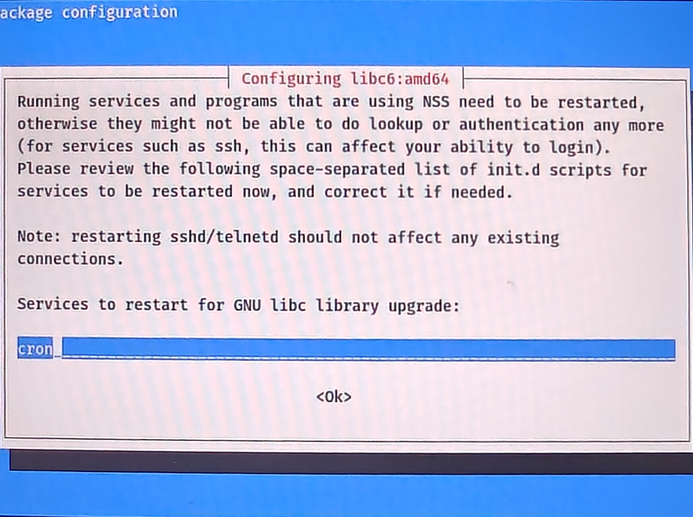
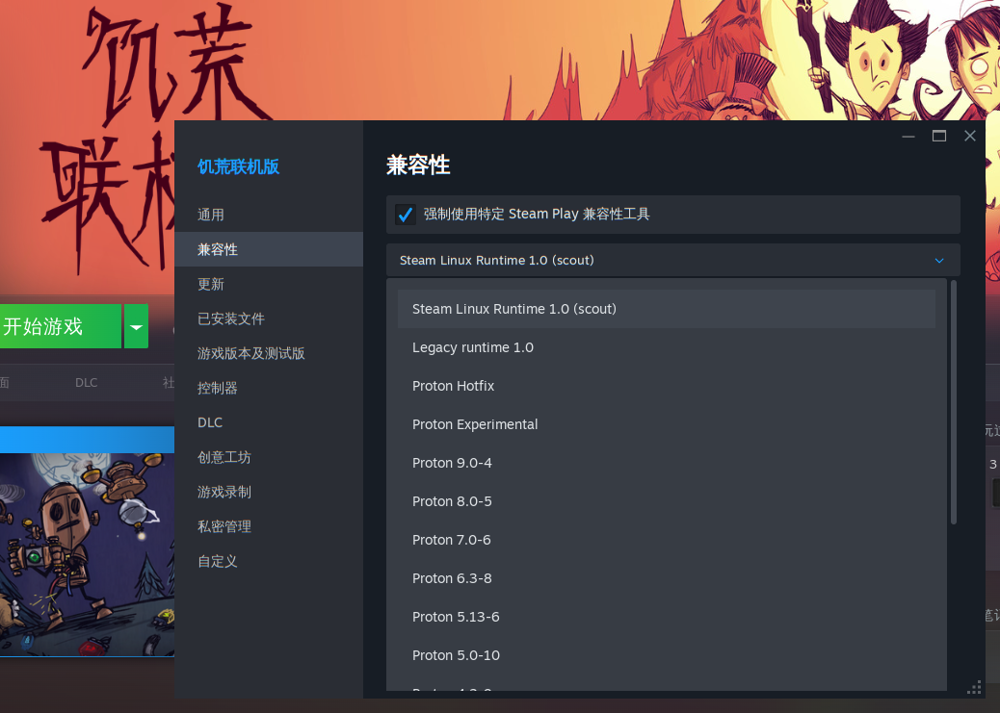

# 总览
1. 联网更新+验证Everything是否成功
2. 中文输入法设置
3. 安装nvidia输入法
4. 安装QQ、微信、Obsidian、syncthing、QQ音乐、VPN等常用软件的deb安装包
5. ……
6. ***全文以kali linux Everything的版本为例，桌面环境使用GNOME***
---
## 1.联网更新+验证Everything是否成功
- 联网更新
先联网，然后在终端模拟器中输入：
```bash
sudo apt update             //更新仓库
sudo apt full-upgrade -y    //更新所有软件并（-y）同意
```
需要的时间很长
- 验证Everything是否成功
在模拟终端输入：
```bash
kali-linux-everything --help
```
或
```bash
dpkg -l | grep kali-linux
```

- **更新时碰见问题这样选**

no


不填


ok


空格键勾选，上下左右键移动，tab键移动光标位置，enter键确定


---
## 2.中文输入法设置

***1. 打开虚拟终端模拟器，命令行输入：***
```bash
sudo apt update
sudo apt install ibus ibus-pinyin ibus-libpinyin ibus-table -y
sudo reboot //不重启的话，ibus-setup配置工具中找不到中文

ibus-setup  //启动 IBus 配置工具,会有图形化界面，在里面配置

```
>[!tip]
>- `ibus` 是输入法框架
>- `ibus-pinyin` 是一个常见的拼音输入法
>- `ibus-libpinyin` 提供了更高效的拼音输入法
>- `ibus-table` 是用于其他输入法（如五笔、仓颉）的输入法表
>- 一定要先下载好输入法，在到GNOME中找中文，不然找不到
- **设置输入法**：
    - 在弹出的 **IBus Preferences** 窗口中，点击左侧的 **Input Method** 标签。
    - 点击右侧的 **Add** 按钮，弹出 **Add Input Method** 窗口。
    - 在列表中找到 **Chinese**，然后选择 **Pinyin**（拼音）或者 **Libpinyin**（如果你希望更流畅一些的话），然后点击 **Add**。
- **选择输入法**：
    - 你现在应该看到输入法已经添加到了列表中。在 **IBus Preferences** 窗口中确认并点击 **Close**

***2. 进入GNOME的设置：***
- **打开 GNOME 设置**：
    - 在 GNOME 中，点击左上角的 **活动**（Activities）按钮，然后搜索并打开 **Settings**（设置）。
- **选择 Language & Region**：
    - 在设置中，选择 **Region & Language**（地区与语言）选项。
- **更改语言**：
    - 在 **Language** 选项中，选择 **Chinese**（中文）。你可以选择简体中文或繁体中文，这样整个系统的语言将切换为中文。
- **设置键盘输入法**：
    - 在 **Input Sources**（输入源）下，点击 **+**，选择 **Chinese**（中文），然后选择你之前安装的拼音输入法（如 **Pinyin** 或 **Libpinyin**）。
    - 点击 **Add** 添加。
2. 输入法设置都比较简单，[KDE桌面看这里](/posts/systemdownload/input-method-and-permission-settings-for-kde-desktop-environment-on-debian-system/)
---
## 3.安装nvidia驱动
- kali中安装NVIDIA驱动非常简单，不需要建立黑名单之类的
- 具体流程看：[Kali系统安装NVIDIA显卡驱动指南](/posts/systemdownload/kali-system-installation-guid-for-nvidia-graphics-card-drivers/)

---
## 4.安装软件
```bash
安装
sudo apt install ./加deb软件安装包  //在安装包所在的目录下进行
卸载
sudo apt purge 软件名
```
- QQ音乐在wayland下无法使用，在X11中可以运行
- QQ、微信没有问题
- VPN工具使用的是FIclash和红岸云
- Obsidian和Syncthing可以正常使用（Syncthing是 `.tar.gz` 的压缩包，使用方法：解压到喜欢的文件夹下，然后打开解压后的文件夹，找到 Syncthing 文件，右键后点击**执行**，配置页面在[http://localhost:8384/](http://localhost:8384/)）
- Steam可以下在并运行，但需要下载兼容工具
