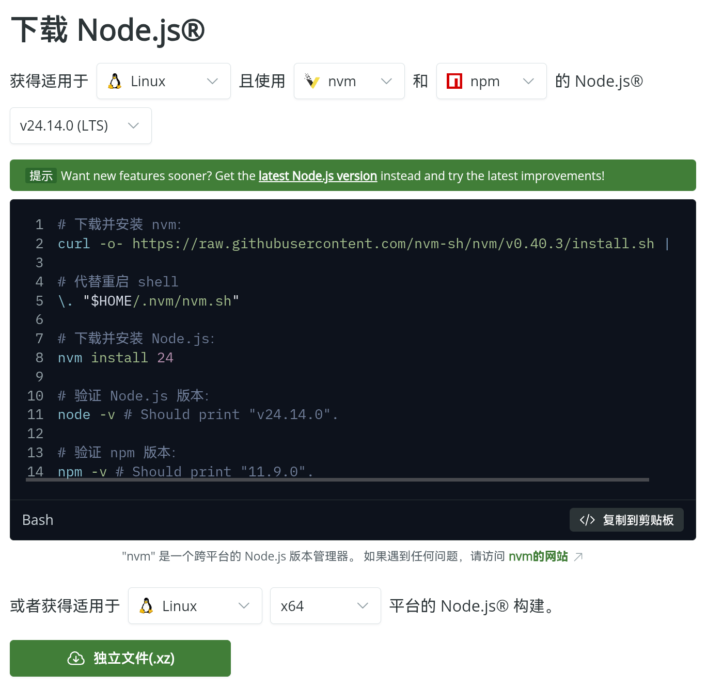

> 为了安全性，最好还是放在Docker或虚拟机里

# 1. 下载nodejs
1. 登陆[nodejs下载页](https://nodejs.org/zh-cn/download)

2. 选择使用nvm和npm的Node.js的最新稳定版（带有LTS的就是稳定版），并使用代码下载
```bash
# 下载并安装 Chocolatey：
powershell -c "irm https://community.chocolatey.org/install.ps1|iex"

# 下载并安装 Node.js：
choco install nodejs --version="24.14.0"

# 验证 Node.js 版本：
node -v # Should print "v24.14.0".

# 验证 npm 版本：
npm -v # Should print "11.9.0".
```
3. 安装完成
---
# 2. 下载Git
- 更新一下库就好了,kali自带Git
---

# 3. 下载和配置龙虾
1. 下载龙虾
	- 打开[官网的安装文档](https://docs.openclaw.ai/zh-CN/install)，使用快速安装命令即可 `curl -fsSL https://openclaw.ai/install.sh | bashl`
2. 配置龙虾
	很简单，全程傻瓜式安装，看不懂英文翻译一下就好了